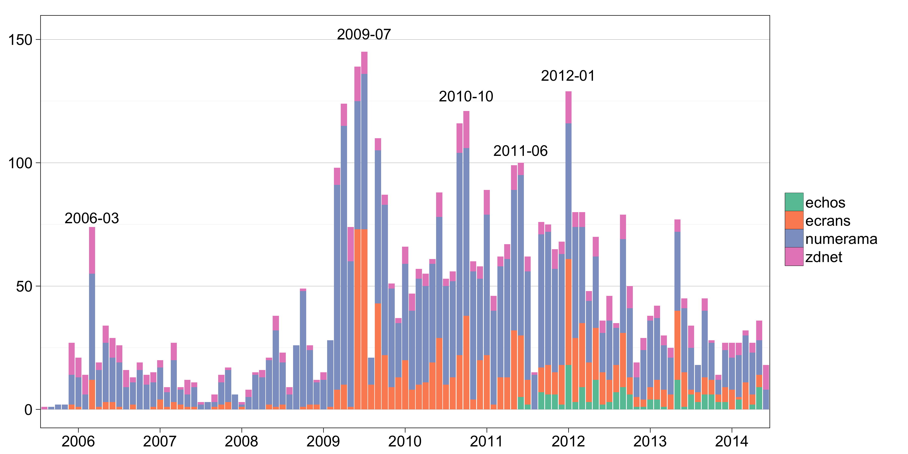

Code related to a [working paper][paper] that was [first presented][draft] at the [AFSP](http://www.afsp.msh-paris.fr/) Annual Meeting in Paris, 2013. See Section 1 of [this paper][paper] and [its appendix][appendix], or read the [HOWTO](#howto) below for a technical summary.

> * June 2014 – Major update
    * Updated [working paper][paper]
	* Added [new appendix][appendix]
	* Added five media scrapers
	* Updated [Google Trends][gtrends] data
* June 2013 – First release
	* [First draft][draft]
	* [Conference slides][slides]

[gtrends]: https://www.google.com/trends/
[draft]: https://github.com/briatte/afsp2013/raw/master/afsp2013/draft.pdf
[slides]: https://github.com/briatte/afsp2013/raw/master/afsp2013/slides.pdf
[paper]: http://goo.gl/C8kW1s
[appendix]: http://goo.gl/gaKlFD

# DATA

The scraper currently collects slightly over 6,300 articles from 

* ecrans.fr (including articles from liberation.fr)
* lemonde.fr (first lines only for paid content)
* lesechos.fr (left-censored to December 2011)
* lefigaro.fr (first lines only for paid content)
* numerama.com (including old articles from ratiatium.com)
* zdnet.fr

# HOWTO

The entry point is `make.r`:

* `get_articles` will scrape the news sources (adjust page counters to current website search results to update the data)
* `get_corpus` will extract all entities and list the most common ones (set minimum frequency with `threshold`; defaults to 10)
* `get_ranking` will export the top 15 central nodes of the co-occurrence network to the `tables` folder, in Markdown format
* `get_network` returns the co-occurrence network, optionally trimmed to its top quantile of weighted edges (set with `threshold`; defaults to 0)

## Tables

* `corpus.terms.csv` – a list of all entities, ordered by their raw counts
* `corpus.freqs.csv` – a list of entities found in each article
* `corpus.edges.csv` – a list of undirected weighted network ties

## Notes

* The weighting scheme is inversely proportional to the number of entity pairs in each article.
* The weighted degree formula is by [Tore Opsahl](http://toreopsahl.com/tnet/weighted-networks/node-centrality/) and uses an alpha parameter of 1.
