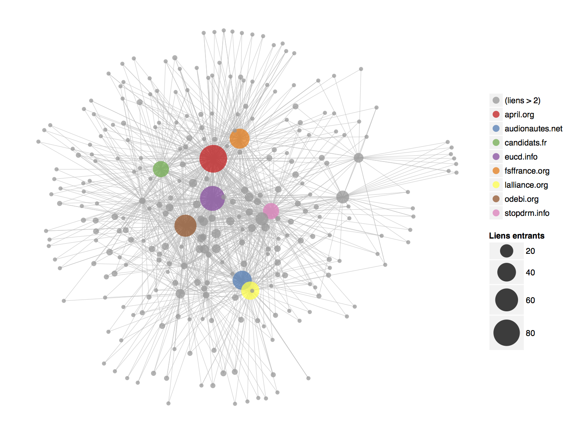

Replication files for some of the figures in [the paper][paper]:

* `google-trends.R` reproduces Figure 1 using data collected with [Google Trends][gtrends] in May 2013
* `scrapers.R` reproduces Figure 2 using data collected with [scrapers][scrapers] from Numerama.com and ZDNet.fr in May 2013
* `voson.R` reproduces Figures 6 (shown above) and 7 using data collected with [VOSON][voson] in 2008 and 2011

See also the [`flegscrap`][flegscrap] and [`ggnet`][ggnet] repositories for related work.

[paper]: https://github.com/briatte/afsp2013/raw/master/paper.pdf
[scrapers]: blob/master/data/scrape.all.R
[gtrends]: https://www.google.com/trends/
[voson]: http://voson.anu.edu.au/
[flegscrap]: https://github.com/briatte/flegscrap/
[ggnet]: https://github.com/briatte/ggnet/

__Work in progress.__ Thanks to [Bram](/Psycojoker) and [Stef](/stef) for letting me know about XPath syntax, and apologies for using R where Python would certainly do a better scraping job.

> Last revised 2013-06-24
