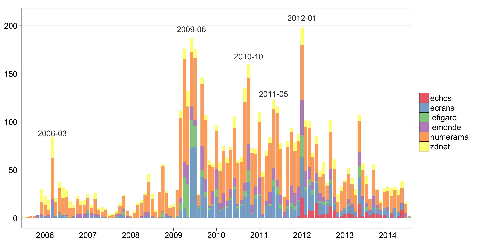

Code related to a [working paper][paper] that was [first presented][draft] at the [AFSP](http://www.afsp.msh-paris.fr/) Annual Meeting in Paris, 2013. See the [HOWTO](#howto) below for a technical summary of the data presented in Section 1 of the [paper][paper] and in the [appendix][appendix].

> * June 2014 – Updated [working paper][paper]
	* Added [new appendix][appendix]
	* Added two media scrapers
	* Updated [Google Trends][gtrends] data
* June 2013 – First release
	* [First draft][draft]
	* [Conference slides][slides]

[gtrends]: https://www.google.com/trends/
[draft]: https://github.com/briatte/afsp2013/raw/master/afsp2013/draft.pdf
[slides]: https://github.com/briatte/afsp2013/raw/master/afsp2013/slides.pdf
[paper]: http://goo.gl/C8kW1s
[appendix]: http://goo.gl/gaKlFD

# DATA

The scraper currently collects slightly over 5,000 articles from 

* ecrans.fr, including articles from liberation.fr
* lesechos.fr
* numerama.com, including articles from ratiatium.com (defunct)
* zdnet.fr

The list of detected entities includes politicians, industries and nominal ISPs from France, Europe and North America (e.g. "Free", "Verizon"), civil servants, political parties, professional representatives,trade unions, activists, academics, prominent legislation and legal cases (incl. "IPRED", "DMCA", "Jamendo", "Megaupload", "The Pirate Bay", "Mulholland Drive", "Sabam", "SOS-Hadopi"...) and French Web companies (e.g. "Dailymotion", "Deezer").

Some entities can be ambivalent, as for telecom companies like "Facebook" and "Twitter" that can be mentioned both as services and as corporate entities, or individuals who can be cited both in person or as rapporteurs. For similar reasons, Martin Bouygues is coded separately to "Bouygues", but public reports are coded as a single entity in the cases of Pierre Lescure ("mission Lescure"), Denis Olivennes ("mission Olivennes"), Patrick Zelnik ("mission Zelnik") and Marielle Gallo ("rapport Gallo").

Excluded terms include French language stopwords, case-specific stopwords ("DAVDSI", "DADVSI", "(Loi |Projet )?Dadvsi", "Loi (Création|Hadopi)", "Hadopi", "HADOPI", "Parlement", "Elysée", "Sénat", "Assemblée( Nationale)?""Président de la République", "Élysée", "(Ministère de la |Ministre de la )?Culture", "Gouvernement"), names of bloggers, journalists and media titles (e.g. "AFP", "Bluetouff", "Korben", "Libélabo", "Reflets", "Reuters") and generic terms like "ADSL", "CD", "FAI" and "SPRD".

# HOWTO

The entry point is `make.r`:

* `get_articles` will scrape the news sources (adjust page counters to current website search results to update the data)
* `get_corpus` will extract all entities and list the most common ones (set minimum occurrence with `threshold`; defaults to 10)
* `get_ranking` will export the top 15 central nodes of the co-occurrence network to the `tables` folder, in Markdown format
* `get_network` returns the co-occurrence network, optionally trimmed to its top weighted edges (set with `threshold`; defaults to 0)

## Summary tables

* `corpus.terms.csv` – a list of all entities, ordered by their raw counts
* `corpus.freqs.csv` – a list of weighted entities in each article
* `corpus.edges.csv` – a list of weighted network edges

## Weighting scheme

* For each entity in each article of the corpus, its propensity of occurrence is its frequency divided by the number of entities in the article
* For each dyad of entities in each article, the propensity of co-occurrence is the product of their propensity of occurrence
* For each dyad, the overall weighted propensity of co-occurrence is the sum of its weights over all articles in the corpus

The tie weight used to compute the degree of each node in the co-occurrence network is therefore

where _k_ designates each item in a corpus of _k_ = 1, 2, ..., _N_ articles, _p_ is the frequency of a given entity in that article, and _n_ the total number of entities in the article.

The weighted degree formula is by [Tore Opsahl](http://toreopsahl.com/tnet/weighted-networks/node-centrality/) and uses an alpha parameter of 1.
